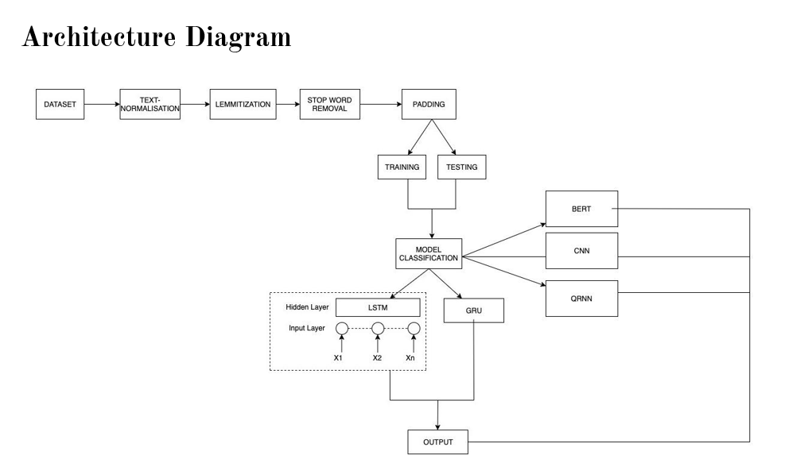
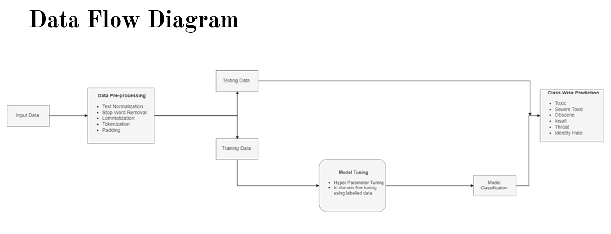

# Multilingual Toxic Comment Classifier

With the rapid growth of social media platforms, online discussions have become an integral part of daily communication. However, these platforms are often affected by toxic behavior such as hate speech, abusive language, and threats.

This project builds a **Multilingual Toxic Comment Classifier** that automatically detects toxic comments across social media conversations and categorizes them into different types of toxicity.

The system uses **Natural Language Processing (NLP)** and **Deep Learning models** to classify comments into multiple toxicity labels.

---

# Problem Definition

Online communication is now a core part of people’s daily internet experience. However, in many cases, users post rude, abusive, or threatening comments that harm online communities.

Toxic comments can:
- Discourage people from expressing their opinions
- Create hostile environments in online discussions
- Reduce productivity and collaboration in online platforms

This project aims to detect toxic comments in multilingual datasets and classify them into the following categories:

- Toxic  
- Severe Toxic  
- Obscene  
- Threat  
- Insult  
- Identity Hate  

Automatically identifying such comments can help **moderate discussions and create safer online spaces.**

---

# Dataset

This project uses the **Google Jigsaw Toxic Comment Dataset** from Kaggle.

**Dataset Details**

- Total Instances: **153,164**
- Multi-label classification problem
- Each comment can belong to multiple toxicity categories.

**Labels**

| Label | Description |
|------|-------------|
| Toxic | General toxic comment |
| Severe Toxic | Highly toxic comment |
| Obscene | Contains obscene language |
| Threat | Contains threatening language |
| Insult | Contains insulting words |
| Identity Hate | Hate speech targeting identity groups |

Dataset Link:

https://www.kaggle.com/datasets/koheishima/jigsaw-toxic-comment-dataset

---

# Architecture Diagram

The following diagram shows the overall architecture of the toxic comment classification system.

The architecture includes the following steps:

1. Dataset input
2. Text normalization
3. Lemmatization
4. Stop word removal
5. Padding
6. Train-test split
7. Model classification

Multiple deep learning models are used for classification:

- **BERT**
- **CNN**
- **QRNN**
- **LSTM**
- **GRU**

These models process the textual data and generate predictions for each toxicity category.

---

# Data Flow Diagram

The following diagram illustrates how data moves through the system.

Data processing steps include:

1. Input Data
2. Data Preprocessing
   - Text normalization
   - Stop word removal
   - Lemmatization
   - Tokenization
   - Padding
3. Data split
   - Training data
   - Testing data
4. Model tuning
   - Hyperparameter tuning
   - Domain-specific fine tuning
5. Model classification
6. Class-wise prediction output

Output categories include:

- Toxic
- Severe Toxic
- Obscene
- Insult
- Threat
- Identity Hate

---

# Technologies Used

- Python
- TensorFlow / PyTorch
- Scikit-learn
- Pandas
- NumPy
- NLP Techniques
- Deep Learning Models

---
